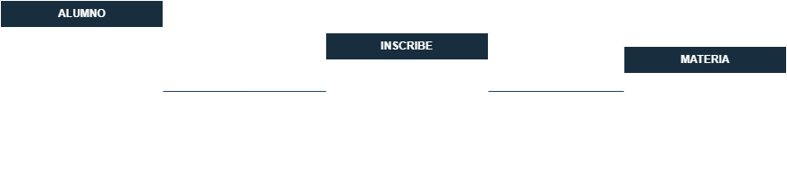
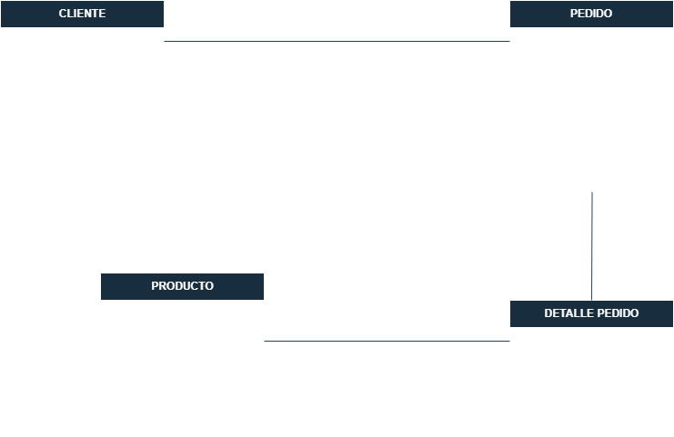
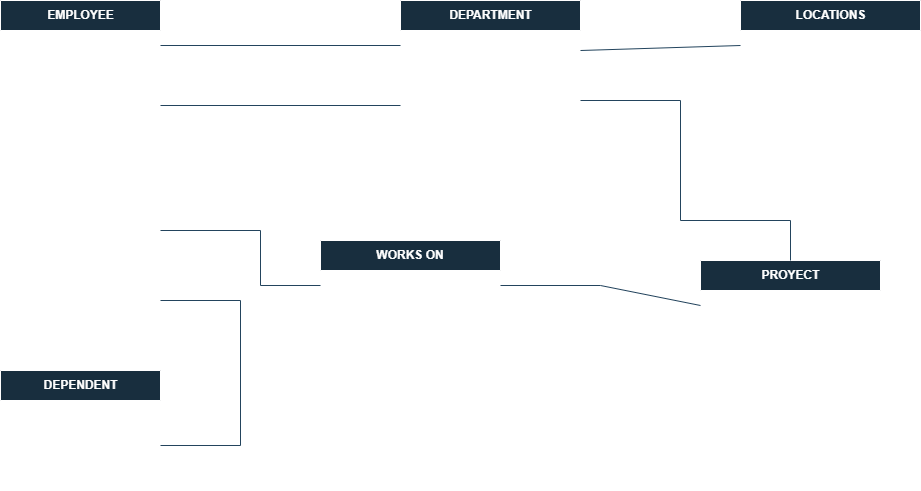

# Ejercicios modelo E-R a modelo Relacional

```
1. Hospital
```
- Modelo E-R


- Modelo relacional

---

```
2. Universidad
```
- Modelo E-R


- Modelo relacional

---
```
3. Escuela
```
- Modelo E-R


- Modelo relacional

---
```
4. Empresa
```
- Modelo E-R


- Modelo relacional

---
```
5. Company
```
- Modelo E-R


- Modelo relacional
