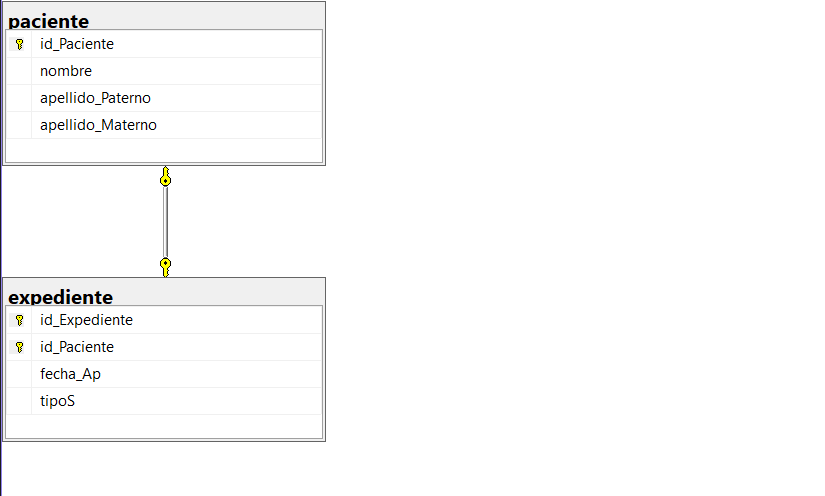

```
-- Crear la base de datos
CREATE DATABASE hospital;
GO

-- Usar la base de datos
USE hospital;
GO

-- Tabla paciente
CREATE TABLE paciente(
	id_Paciente INT NOT NULL IDENTITY(1,1),
	nombre VARCHAR(50) NOT NULL,
	apellido_Paterno VARCHAR(30) NOT NULL,
	apellido_Materno VARCHAR(30) NOT NULL,
	CONSTRAINT pk_paciente
	PRIMARY KEY (id_Paciente)
);
GO

-- Tabla expediente
CREATE TABLE expediente(
	id_Expediente INT NOT NULL IDENTITY(1,1),
	id_Paciente INT NOT NULL,
	fecha_Ap DATETIME2 NOT NULL
	CONSTRAINT df_expediente_fechaAp
	DEFAULT SYSDATETIME(),
	tipoS VARCHAR(50) NOT NULL,
	CONSTRAINT pk_expediente
	PRIMARY KEY (id_Expediente, id_Paciente),
	CONSTRAINT uq_expediente_idPaciente
	UNIQUE (id_Paciente),
	CONSTRAINT fk_expediente_paciente
	FOREIGN KEY (id_Paciente)
	REFERENCES paciente(id_Paciente)
);
GO
```
## Diagrama final

