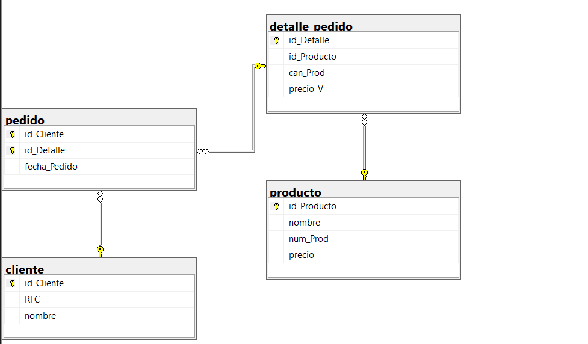

```
-- Crear la base de datos
CREATE DATABASE empresa4;
GO

-- Usar la base de datos
USE empresa4;
GO

--Tabla cliente
CREATE TABLE cliente(
    id_Cliente INT NOT NULL IDENTITY(1,1),
    RFC CHAR(13) NOT NULL,
    nombre VARCHAR(40) NOT NULL,
    CONSTRAINT pk_cliente PRIMARY KEY (id_Cliente),
    CONSTRAINT uq_cliente_rfc UNIQUE (RFC)
);
GO

--Tabla producto
CREATE TABLE producto(
    id_Producto INT NOT NULL IDENTITY(1,1),
    nombre VARCHAR(40) NOT NULL,
    num_Prod INT NOT NULL,
    precio DECIMAL(10,2) NOT NULL,
    CONSTRAINT pk_producto PRIMARY KEY (id_Producto),
    CONSTRAINT ck_producto_numProd CHECK (num_Prod > 0),
    CONSTRAINT ck_producto_precio CHECK (precio > 0.0)
);
GO

-- Tabla detalle_pedidp

CREATE TABLE detalle_pedido(
    id_Detalle INT NOT NULL IDENTITY(1,1),
    id_Producto INT NOT NULL,
    can_Prod INT NOT NULL,
    precio_V DECIMAL(10,2) NOT NULL,
    CONSTRAINT pk_detalle PRIMARY KEY (id_Detalle),
    CONSTRAINT fk_detalle_producto FOREIGN KEY (id_Producto)
        REFERENCES producto(id_Producto),
    CONSTRAINT ck_detalle_cantidad CHECK (can_Prod > 0),
    CONSTRAINT ck_detalle_precioV CHECK (precio_V > 0.0)
);
GO

--Tabla pedido
CREATE TABLE pedido(
    id_Cliente INT NOT NULL,
    id_Detalle INT NOT NULL,
    fecha_Pedido DATETIME2 NOT NULL
        CONSTRAINT df_pedido_fecha DEFAULT SYSDATETIME(),
    CONSTRAINT pk_pedido PRIMARY KEY (id_Cliente, id_Detalle),
    CONSTRAINT fk_pedido_cliente FOREIGN KEY (id_Cliente)
        REFERENCES cliente(id_Cliente),
    CONSTRAINT fk_pedido_detalle FOREIGN KEY (id_Detalle)
        REFERENCES detalle_pedido(id_Detalle)
);
GO
```
## Diagrama final
