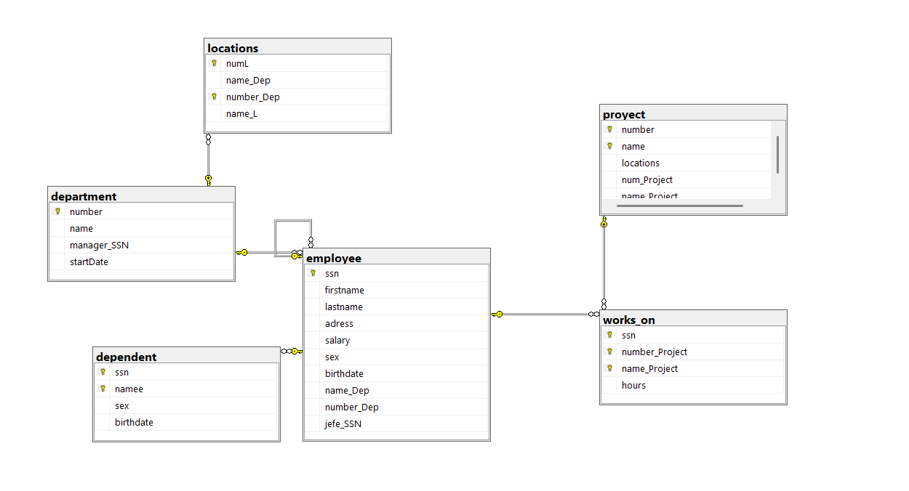

```
-- Crear la base de datos
CREATE DATABASE company;
GO

-- Usar la base de datos
USE company;
GO

--Tabla department
CREATE TABLE department(
    number INT NOT NULL,
    name VARCHAR(40) NOT NULL,
    manager_SSN CHAR(9) NOT NULL,
    startDate DATETIME2 NOT NULL
    CONSTRAINT df_department_start DEFAULT SYSDATETIME(),
    CONSTRAINT pk_department PRIMARY KEY (number),
    CONSTRAINT uq_department_name UNIQUE (name)
);
GO

-- Tabla employee
CREATE TABLE employee(
    ssn CHAR(9) NOT NULL,
    firstname VARCHAR(30) NOT NULL,
    lastname VARCHAR(30) NOT NULL,
    adress VARCHAR(100),
    salary DECIMAL(10,2) CHECK (salary > 0),
    sex CHAR(1) CHECK (sex IN ('M','F')),
    birthdate DATE NOT NULL,
    name_Dep VARCHAR(40) NOT NULL,
    number_Dep INT NOT NULL,
    jefe_SSN CHAR(9),
    CONSTRAINT pk_employee PRIMARY KEY (ssn),
    CONSTRAINT fk_employee_department FOREIGN KEY (number_Dep)
        REFERENCES department(number),
    CONSTRAINT fk_employee_jefe FOREIGN KEY (jefe_SSN)
        REFERENCES employee(ssn)
);
GO

--Tabla locations
CREATE TABLE locations(
    numL INT NOT NULL,
    name_Dep VARCHAR(40) NOT NULL,
    number_Dep INT NOT NULL,
    name_L VARCHAR(40) NOT NULL,
    CONSTRAINT pk_locations PRIMARY KEY (numL, number_Dep),
    CONSTRAINT fk_locations_department FOREIGN KEY (number_Dep)
        REFERENCES department(number)
);
GO

--Tabña proyect
CREATE TABLE proyect(
    number INT NOT NULL,
    name VARCHAR(40) NOT NULL,
    locations VARCHAR(40),
    num_Project INT,
    name_Project VARCHAR(40),
    CONSTRAINT pk_proyect PRIMARY KEY (number, name)
);
GO

--Tabla works_on
CREATE TABLE works_on(
    ssn CHAR(9) NOT NULL,
    number_Project INT NOT NULL,
    name_Project VARCHAR(40) NOT NULL,
    hours DECIMAL(5,2) CHECK (hours >= 0),
    CONSTRAINT pk_works_on PRIMARY KEY (ssn, number_Project, name_Project),
    CONSTRAINT fk_works_on_employee FOREIGN KEY (ssn)
    REFERENCES employee(ssn),
    CONSTRAINT fk_works_on_proyect FOREIGN KEY (number_Project, name_Project)
    REFERENCES proyect(number, name)
);
GO

--Tabla dependent
CREATE TABLE dependent(
    ssn CHAR(9) NOT NULL,
    namee VARCHAR(40) NOT NULL,
    sex CHAR(1) CHECK (sex IN ('M','F')),
    birthdate DATE NOT NULL,
    CONSTRAINT pk_dependent PRIMARY KEY (ssn, namee),
    CONSTRAINT fk_dependent_employee FOREIGN KEY (ssn)
    REFERENCES employee(ssn)
);
GO
```
## Diagrama final 
