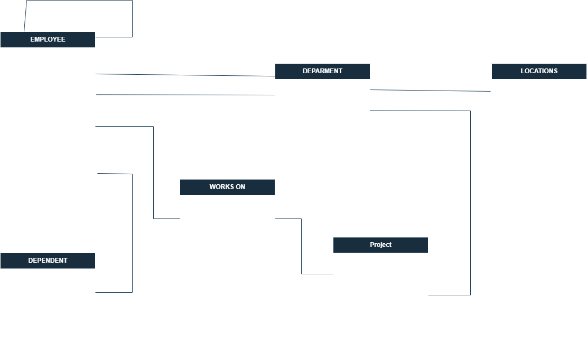

# Diccionario de Datos de la base de datos de Control Escolar

1. Informacion escolar

| Elemento | Valor |
|-----------|-----------|
| Proyecto    | Control Escolar    |
| Version    |  1.0 |
| Fecha   | Junio 2026    |
| Elaboro    | Ing. Jose Luis Herrera Gallardo    |
| SGDB   |  SQL Server |

2. Descripcion del Sistema de base de datos 

El sistema administra: 
- Carreras 
- Alumnos 
- Profesores 
- Materias 
- Grupos 
- Inscripciones 

Permite controlar la oferta academica y la inscripcion de estudiantes 

3. Catalogo de Restricciones utilizadas 

| Codigo | Significado  |
|-----------|-----------|
| PK    | Primary Key   |
| FK    | Foreign Key   |
| NN    | Not null      |
| Uq    | Unique        |
| AI    | Auto increment|
| CK    | Check         |
| DF    | Default       |

4. Diccionario de datos 

## Tabla: Carrera 

**Descripcion**

Almacena las carreras ofertadas por la universidad 

| Campo | Tipo  | Longitud | Restricciones  | Descripcion |
|-----------|-----------|-----------|-----------|-----------|
| Id carrera | INT    | -  | PK, AI, NN    | Identificador unico de la carrera |
| Nombre    | VARCHAR    | 100    |  UQ, NN    | Nombre de la carrera    |
| Duracion_cuatrimetre    | INT    | -   | NN CK(>0)   | NOmbre de la carrera   |
| Fila 4    | Dato 13   | Dato 14   | Dato 15   | Dato 16   |

Tipos de datos para sql server, maria db, postrgres 

----

## Tabla alumno

Almacena informacion de los estudiantes

| Campo | Tipo  | Longitud | Restricciones  | Descripcion |
|-----------|-----------|-----------|-----------|-----------|
| id_alumno | INT    | -  | PK, AI, NN    | Identificador unico del alumno|
| Matricula    | VARCHAR   | 10   | UQ, NN   | Matricula Institucional   |
| nombre    | VARCHAR    | 50    |   NN    | Nombre del alumno   |
| apellido_paterno    | VARCHAR    | 50    |  UQ, NN    | Apellido paterno   |
| apellido_materno    | VARCHAR    | 50    |  UQ, Null    | Apellido materno   |
| correo    | VARCHAR    | 50    |  NN    | Correo Institucional   |
| fecha_nacimiento   | DATE    | -    |  NN    | Fecha de Nacimiento   |
| id_carrera    | INT    | -  |  FK, NN    | Carrera perteneciente   |
| apellido_materno    | VARCHAR    | 50    |  UQ, Null    | Apellido materno   |

---

5. Relaciones en la base de datos

| Relacion | Cardinalidad | Descripcion |
|-----------|-----------|-----------|
| carrera -> Alumno   | 1:N  | Una carrera tiene muchos alumnos    |
| carrera -> Materia  | 1:N  | Una carrera tiene muchas materias    |
| Profesor -> Grupo   | 1:N  | Una profesor puede impartir muchos grupos    |
| Materia -> Grupo    | 1:N  | Una materia puede abrirse en muchos grupos    |
| Alumno -> Inscripcion  | 1:N  | Un alumno puede tener varias inscripciones    |
| Grupo -> Inscripcion  | 1:N  | Un grupo puede tener muchos alumnos    |

6. Matriz de Claves Foraneas 

| Tabla | Campo FK | Referencia |
|-----------|-----------|-----------|
| Alumno    | id_carrera   | Carrera(id_carrera)    |
| Materia    | id_carrera   | Carrera(id_carrera)    |
| Grupo    | id_profesor   | Profesor(id_profesor)    |
| Grupo     | id_materia   | Materia(id_materia)    |
| Inscripcion    | id_grupo   | Grupo(id_grupo)    |

7. Inter¿gridad referencial

| Codigo | Regla |
|-----------|-----------|
| IN_01     | No se puede registrar un alumno en una carrera inexistente |
| IN_02     | No se puede crear un grupo para una materia inexistente    |
| IN_03     | No se puede crear un grupo para un profesor inexistente    |
| IN_04     | No se puede inscribir un alumno a un grupo inexistente     |
| IN_05     | No se puede eliminar una carrera que tenga alumnos asociados sin antes reasignarlos o eliminarlos    |

8. 

| Codigo | Regla |
|-----------|-----------|
| IN_01     | Un alumno pertenece a una sola carrea    |
| IN_02     | Una carrera puede tener muchos alumnos   |
| IN_03     | Una carrera puede tener muchas materias  |
| IN_04     | Un profesor puede impartir varios grupos   |
| IN_05     | Un grupo solo puede tener un profesor asignado   |
| IN_05     | La calificacion puede estar entre 0.0 y 10.0   |

9. Diagrama relacional

